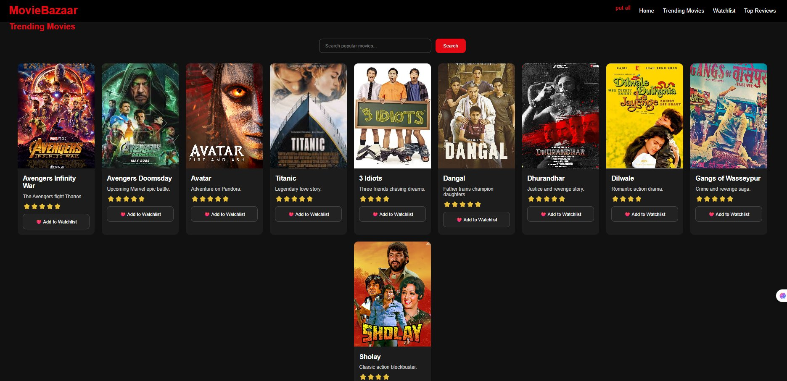
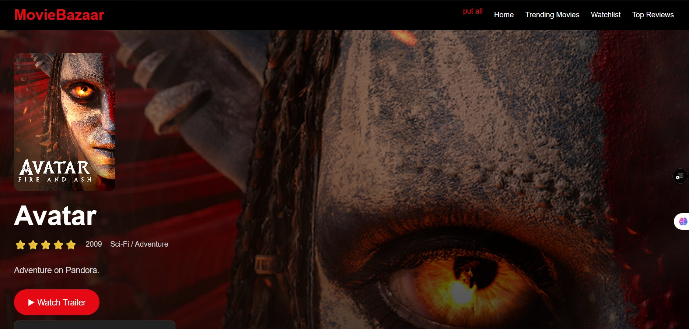

<div align="center">

<br/>

```
███╗   ███╗ ██████╗ ██╗   ██╗██╗███████╗    ██████╗  █████╗ ███████╗ █████╗  █████╗ ██████╗ 
████╗ ████║██╔═══██╗██║   ██║██║██╔════╝    ██╔══██╗██╔══██╗╚══███╔╝██╔══██╗██╔══██╗██╔══██╗
██╔████╔██║██║   ██║██║   ██║██║█████╗      ██████╔╝███████║  ███╔╝ ███████║███████║██████╔╝
██║╚██╔╝██║██║   ██║╚██╗ ██╔╝██║██╔══╝      ██╔══██╗██╔══██║ ███╔╝  ██╔══██║██╔══██║██╔══██╗
██║ ╚═╝ ██║╚██████╔╝ ╚████╔╝ ██║███████╗    ██████╔╝██║  ██║███████╗██║  ██║██║  ██║██║  ██║
╚═╝     ╚═╝ ╚═════╝   ╚═══╝  ╚═╝╚══════╝    ╚═════╝ ╚═╝  ╚═╝╚══════╝╚═╝  ╚═╝╚═╝  ╚═╝╚═╝  ╚═╝
```

### 🎬 *Your Ultimate Movie Discovery Platform — Built with Pure HTML, CSS & JavaScript*

<br/>

[](https://moviebazaar-smoky.vercel.app/)
[](https://github.com/rishijain544/moviebazaar)
[](https://moviebazaar-smoky.vercel.app/)
[](https://github.com/rishijain544/moviebazaar)

<br/>

---

</div>

<br/>

## ✨ What is MovieBazaar?

**MovieBazaar** is a sleek, fully responsive movie showcase web application built with **zero frameworks** — just raw HTML, CSS, and JavaScript. It brings together Hollywood blockbusters and Bollywood classics into one beautiful, interactive experience.

Browse trending movies, manage your personal watchlist, search the collection, read and submit reviews — all in your browser, no backend required.

> 🔗 **Live Site:** [https://moviebazaar-smoky.vercel.app/](https://moviebazaar-smoky.vercel.app/)

<br/>

---

## 📸 Screenshots

<br/>

**🎞️ Trending Movies Page**



> Browse all trending movies in a beautiful dark-themed grid with posters, ratings, and one-click watchlist buttons.

<br/>

**🎬 Movie Detail Page**



> Immersive full-screen hero banner with movie poster, year, genre, rating, description and a Watch Trailer CTA.

<br/>

---

## 🚀 Features

| Feature | Description |
|---|---|
| 🎥 **Hero Banner** | Cinematic full-width spotlight on the featured film |
| 🔍 **Live Search** | Instantly filter movies by title as you type |
| ❤️ **Watchlist** | Add & remove movies from your personal watchlist |
| ⭐ **Star Ratings** | Visual rating display for every movie card |
| 📝 **Reviews Section** | Submit and browse public movie reviews |
| 📱 **Responsive Design** | Fully optimized for desktop, tablet, and mobile |
| 🎭 **Multi-genre** | Hollywood, Bollywood, and more in one place |
| ⚡ **No Dependencies** | Pure HTML/CSS/JS — loads instantly everywhere |

<br/>

---

## 🎬 Movie Collection

MovieBazaar currently showcases **10 handpicked films** across genres:

<br/>

**🌍 Hollywood Picks**
- 🦸 **Avengers: Infinity War** — The Avengers fight Thanos ⭐⭐⭐⭐⭐
- 💥 **Avengers: Doomsday** — Upcoming Marvel epic battle ⭐⭐⭐⭐⭐
- 🌿 **Avatar** — Adventure on Pandora ⭐⭐⭐⭐⭐
- 🚢 **Titanic** — Legendary love story ⭐⭐⭐⭐⭐

**🇮🇳 Bollywood Picks**
- 🎓 **3 Idiots** — Three friends chasing dreams ⭐⭐⭐⭐
- 🤼 **Dangal** — Father trains champion daughters ⭐⭐⭐⭐⭐
- 🕵️ **Dhurandhar** — Justice and revenge story ⭐⭐⭐⭐⭐
- 💘 **Dilwale** — Romantic action drama ⭐⭐⭐⭐
- 🔫 **Gangs of Wasseypur** — Crime and revenge saga ⭐⭐⭐⭐⭐
- 🏇 **Sholay** — Classic action blockbuster ⭐⭐⭐⭐

**🎬 Featured Spotlight**
- 🎯 **Dhurandhar: The Revenge** — 2026 Action/Thriller epic ⭐⭐⭐⭐⭐

<br/>

---

## 🛠️ Tech Stack

```
📦 MovieBazaar
├── 🌐 HTML5          → Structure & semantic layout
├── 🎨 CSS3           → Styling, animations & responsive design
└── ⚙️  JavaScript     → Search, watchlist & review functionality
```

**No frameworks. No npm. No build tools.** Just open and run.

<br/>

---

## 📂 Project Structure

```
moviebazaar/
│
├── 📄 index.html               ← Main landing page (home, trending, watchlist, reviews)
├── 📄 movie.html               ← Movie detail page
│
├── 🖼️  avengers doomsday.jpg
├── 🖼️  avengers infinity.avif
├── 🖼️  avatar.jpg
├── 🖼️  titanic.jpg
├── 🖼️  3 idiots.webp
├── 🖼️  dangal.jpg
├── 🖼️  dhurandhar.jpg
├── 🖼️  dhurandhar the revenge.jpg
├── 🖼️  dilwale.jpg
├── 🖼️  gangs of wasseypur.jpg
├── 🖼️  SHOLAY.jpg
│
└── 📄 README.md
```

<br/>

---

## ⚡ Getting Started

### Run Locally

```bash
# 1. Clone the repository
git clone https://github.com/rishijain544/moviebazaar.git

# 2. Navigate into the folder
cd moviebazaar

# 3. Open in your browser
open index.html
```

> ✅ No installation. No server needed. Just open `index.html` directly in any browser.

<br/>

### Or Visit the Live Site

> 🔗 **[https://moviebazaar-smoky.vercel.app/](https://moviebazaar-smoky.vercel.app/)**

<br/>

---

## 🌐 Deployment

This project is deployed on **Vercel** for zero-config, lightning-fast hosting.

| Platform | URL | Status |
|---|---|---|
| ▲ Vercel | [moviebazaar-smoky.vercel.app](https://moviebazaar-smoky.vercel.app/) | ✅ Live |
| GitHub | [rishijain544/moviebazaar](https://github.com/rishijain544/moviebazaar) | ✅ Public |

**To deploy your own fork:**
1. Fork this repo on GitHub
2. Go to [vercel.com](https://vercel.com) → Import your fork
3. Click **Deploy** — done! ✅

<br/>

---

## 🗺️ Roadmap

- [ ] 🎬 Add more movies with TMDB API integration
- [ ] 🌙 Dark / Light mode toggle
- [ ] 🔖 Persistent watchlist with `localStorage`
- [ ] 🔎 Genre-based filtering
- [ ] 📊 Movie rating system with user votes
- [ ] 🎞️ Trailer embed (YouTube iFrame)
- [ ] 🌍 Multi-language support

<br/>

---

## 🤝 Contributing

Contributions are welcome! Here's how:

```bash
# 1. Fork the project
# 2. Create your feature branch
git checkout -b feature/AmazingFeature

# 3. Commit your changes
git commit -m 'Add some AmazingFeature'

# 4. Push to the branch
git push origin feature/AmazingFeature

# 5. Open a Pull Request
```

<br/>

---

## 👨‍💻 Author

<div align="center">

**Rishi Jain**

[](https://github.com/rishijain544)

*Built with ❤️ and a love for cinema*

</div>

<br/>

---

## 📄 License

This project is open source and available under the [MIT License](LICENSE).

<br/>

---

<div align="center">

⭐ **If you like this project, please give it a star on GitHub!** ⭐

[](https://github.com/rishijain544/moviebazaar)

<br/>

*© 2026 MovieBazaar · Made by Rishi Jain*

</div>
